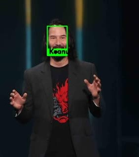
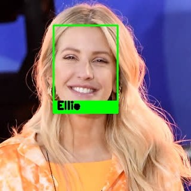
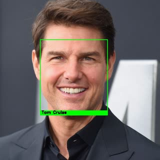
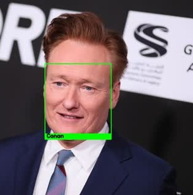

# Facial Recognition System
This facial recognition system uses **Siamese Neural network**. Over the years there have been different architectures published and implemented. There are numerous control parameters to control how you want to use the features, be it face detection, face recognition on videos, or with a webcam. The library uses **dlib**'s face recognition model, which is inspired from **ResNet-34** network. The modified ResNet-34 has 29 Convolutional layers. The model achieved **99.38%** accuracy on LFW dataset. 

There are 4 different face detectors for usage. Wrappers for video and webcam processing are provided for convenience. 

**Refer to USAGE.md for setup and customization details**  
## Table of Contents
- [Facial Recognition System](#facial-recognition-system)
  - [Table of Contents](#table-of-contents)
- [Sample Output](#sample-output)
  - [Processed Video](#processed-video)
  - [Processed Images](#processed-images)
- [Architecture](#architecture)
- [References](#references)

# Sample Output

## Processed Video
 

## Processed Images

# Architecture

For face recognition, flow is:
    media -> frame -> face detection -> Facial ROI -> Neural Network -> 128D facial encoding 

These are the major components:
1. **Face Detection**: There are 4 different face detectors with different cropping options.
2. **Face Recognition**: Responsible for handling facial recognition related functionalities like registering facial data etc. 
3. **Storage**: The system provides abstract definitions of cache and persistent storage. For usage, a simple cache using python's native data structure is provided along side a persistent storage system with JSON. If needed the abstract classes can be extended to integrate better storage systems. 
4. **Utilities**: Methods for handling image, video operations, validations, etc.

# References
Davis E. King: http://dlib.net/cnn_face_detector.py.html, https://github.com/davisking/dlib-models 
More about MTCNN: https://github.com/ipazc/mtcnn
